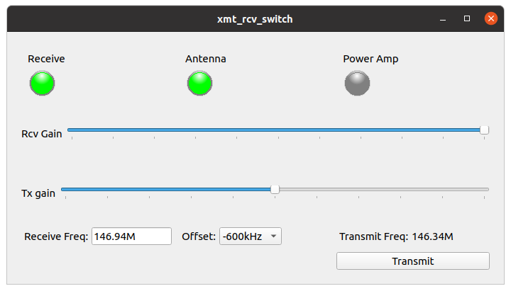

# gr-control
Modular transmit / receive station control

This package contains GNU Radio flowgraphs for transmitters and receivers. They work in conjunction with the station control module which contains ADALM-Pluto source and sink blocks, switching logic to control transmit / receive functions, antenna and power amplifier relay controls, and LED status indicators.

This is a modular design allowing various transmit and receive programs to operate with a common station control program. It is a "plug and play" concept.

The package uses three separate processes which **run concurrently:** station control, a receiver, and a transmitter. They all can be on the same computer or on two or three separate computers according to the users needs.

## Versions

There are two branches of this repository:

* `main` (the default) contains flowgraphs for GNU Radio 3.8 and uses an ADALM-Pluto. The sample rate is set to 576kHz to minimize the processing load when used on a Raspberry Pi computer.
* `maint-3.9` contains flowgraphs for GNU Radio 3.9 and uses a USRP device. The sample rate is set to 768kHz.

Instructions are given below to load the desired version.

## Installation

**IMPORTANT NOTES:**

* These instructions are written for a Linux OS. Similar commands work for Mac and Windows.
* Use the `clone` command rather than downloading a Zip file!

See [What is GNU Radio?](https://wiki.gnuradio.org/index.php/What_is_GNU_Radio%3F) and [Installing GNU Radio](https://wiki.gnuradio.org/index.php/InstallingGR) for background information.

1. Open a terminal window.
2. Change to the home directory.  
```
cd ~/  
```
3. If you don't have 'git', enter  
```
sudo apt install git  
```
4. Clone the repository:  
```
git clone https://github.com/duggabe/gr-control.git
```
5. If you want the 3.9 version, enter:  
    cd ~/gr-control  
    git checkout maint-3.9  
6. For version 3.8, load and build [gr-guiextra](https://github.com/ghostop14/gr-guiextra).  
7. For version 3.8, load and build `gr-iio` as follows:

* Go to [ModuleNotFoundError](https://wiki.gnuradio.org/index.php/ModuleNotFoundError) to set your `PYTHONPATH` and `LD_LIBRARY_PATH`.  
* Once you have started a new terminal, enter `env` to check that you have them set properly.  
* In the following commands, change `/usr/local` if your prefix is different.  

```
cd ~
sudo apt-get -y install libxml2 libxml2-dev bison flex libcdk5-dev cmake git libaio-dev libboost-all-dev swig \
libgmp-dev liborc-0.4-dev libusb-1.0-0-dev doxygen python3-pip

git clone https://github.com/analogdevicesinc/libiio.git
cd ~/libiio
cmake -DCMAKE_INSTALL_PREFIX=/usr/local ./
make all
sudo make install
sudo ldconfig
cd bindings/python/
sudo python3 setup.py.cmakein install
cd ~

git clone https://github.com/analogdevicesinc/libad9361-iio.git
cd ~/libad9361-iio
cmake -DCMAKE_INSTALL_PREFIX=/usr/local ./
make
sudo make install
sudo ldconfig
cd ~

git clone https://github.com/analogdevicesinc/gr-iio.git
cd ~/gr-iio
git checkout upgrade-3.8
cmake -DCMAKE_INSTALL_PREFIX=/usr/local ./
make
sudo make install
sudo ldconfig
cd ~
```

## Operation

The package uses three separate processes. They all can be on the same computer or on two or three separate computers by adjusting the ZMQ socket addresses. See [ZMQ PUB Sink](https://wiki.gnuradio.org/index.php/ZMQ_PUB_Sink#Parameters) for an explanation of Addresses.

### Data Flow Description

1. In the Station Control Module, received data from the Pluto Source block passes through a Mute block to a ZMQ PUB Sink on port 49201.
2. A receiver program (running in a second process) listens with a ZMQ SUB Source on port 49201 and then demodulates the signal.
3. A transmit program (running in a third process) generates a baseband signal and sends it to a ZMQ PUB Sink on port 49203.
4. In the Station Control Module, a ZMQ SUB Source block on port 49203 gets the data to be transmitted and passes it through a Selector block to a Pluto Sink.

### Station Control Module

1. Open a terminal window.
2. Go to the gr-control folder.  
```
cd ~/gr-control
```
2. Execute `xmt_rcv_switch.py`.  
```
python3 -u xmt_rcv_switch.py
```
3. A new window titled `xmt_rcv_switch` will open showing LED status indicators, Rcv Gain control, Receive Freq, Offset (for repeaters), Transmit Freq, and a Transmit switch. Clicking the Transmit switch will perform the following sequence:
  * mute receiver
  * turn off rcv LED
  * switch antenna from rcv to xmt (once implemented)
  * turn on Antenna LED
  * delay 10 ms
  * turn on power amp (once implemented)
  * turn on Amp LED
  * delay 10 ms
  * unmute transmitter

Here is a screen shot:



### Receiver

Currently there are three programs for receiving:

* Narrow Band FM - `NFM_rcv`
* Single Sideband - `SSB_rcv`
* Broadcast FM (mono) - `WBFM_rcv` for 3.8
* Broadcast FM Stereo - `WBFM_stereo` for 3.9

1. Open a second terminal window.
2. Go to the gr-control/Receivers folder.  
```
cd ~/gr-control/Receivers
```
3. Execute the receiver of your choice.  
    `python3 -u NFM_rcv.py`   
    `python3 -u SSB_rcv.py`  
    `python3 -u WBFM_rcv.py`  for 3.8  
    `python3 -u WBFM_stereo.py`  for 3.9  
4. A new window will open showing Volume and Squelch controls as well as a waterfall spectrum display.

If you get lots of audio underruns (`aU`) on your terminal, refer to [Working with ALSA and Pulse Audio](https://wiki.gnuradio.org/index.php/ALSAPulseAudio).

### Transmitter

Currently there are two programs for transmitting:

* Narrow Band FM - `NFM_xmt`
* Single Sideband - `SSB_xmt`

1. Open a third terminal window.
2. Go to the gr-control/Transmitters folder.  
```
cd ~/gr-control/Transmitters
```
3. Execute the transmitter of your choice.  
    `python3 -u NFM_xmt.py`  
    `python3 -u SSB_xmt.py`  
4. A new window will open showing an Audio Gain control as well as a frequency spectrum display. The NFM_xmt screen also has a selector for PL tones. Using a tone of 0.0 turns off the PL.

