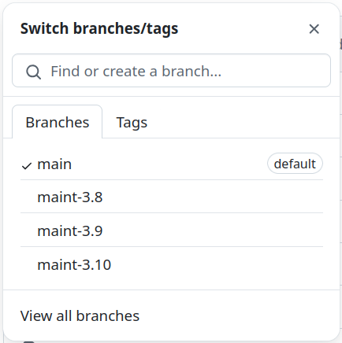

# gr-control
Modular transmit / receive station control

This package contains GNU Radio flowgraphs for transmitters and receivers which work in conjunction with a station control module. The control module contains SDR source and sink blocks, switching logic to control transmit / receive functions, antenna and power amplifier relay controls, and LED status indicators.

This is a modular design allowing various transmit and receive programs to operate with a common station control program. It is a "plug and play" concept.

## Versions

There are three branches of this repository:

* `main` (the default) is the development branch for software not yet put into the maint branches. An additional process is added to implement the relay control using a Raspberry Pi computer.
* `maint-3.8` contains flowgraphs for GNU Radio 3.8 and uses an ADALM-Pluto. The sample rate is set to 576kHz to minimize the processing load if used on a Raspberry Pi computer.
* `maint-3.9` contains flowgraphs for GNU Radio 3.9 and uses a USRP device. The sample rate is set to 768kHz.

Near the top of this page is a pull-down to select the branches.



Choose the branch you want, then continue with the README.md instuctions **for that branch**.

## Installation

**IMPORTANT NOTES:**

* These instructions are written for a Linux OS. Similar commands work for Mac and Windows.
* Use the `clone` command rather than downloading a Zip file!

See [What is GNU Radio?](https://wiki.gnuradio.org/index.php/What_is_GNU_Radio%3F) and [Installing GNU Radio](https://wiki.gnuradio.org/index.php/InstallingGR) for background information.

1. Open a terminal window.
2. Change to the home directory.  
```
cd ~/  
```
3. If you don't have 'git', enter  
```
sudo apt install git  
```
4. Clone the repository:  
```
git clone https://github.com/duggabe/gr-control.git
```
5. Change to the gr-control directory.  
```
cd ~/gr-control
```
6. If you want the `maint-3.8` version, see the branch selection instructions above.
7. If you want the `maint-3.9` version, see the branch selection instructions above.

## Operation

The package uses four separate processes. They all can be on the same computer or on two or more separate computers by adjusting the ZMQ socket addresses. See [ZMQ PUB Sink](https://wiki.gnuradio.org/index.php/ZMQ_PUB_Sink#Parameters) for an explanation of Addresses.

### Data Flow Description

1. In the Station Control Module, received data from the SDR Source passes through a Mute block to a ZMQ PUB Sink on port 49201.
2. A receiver program (running in a second process) listens with a ZMQ SUB Source on port 49201 and then demodulates the signal.
3. A transmit program (running in a third process) generates a baseband signal and sends it to a ZMQ PUB Sink on port 49203.
4. In the Station Control Module, a ZMQ SUB Source block on port 49203 gets the data to be transmitted and passes it through a Selector block to an SDR Sink.

### Station Control Module

#### Main control module

1. Open a terminal window.
2. Go to the gr-control folder.  
```
cd ~/gr-control
```
2. Execute `gnuradio-companion`.  
```
gnuradio-companion
```
3. Open the `xmt_rcv_switch` flowgraph.
4. Change the IP address of the ZMQ SUB Message Source block to the IP of the Raspberry Pi.
5. Change the IP address of the ZMQ PUB Message Sink to the IP of the computer where `xmt_rcv_switch.py` will run (your local computer).
6. Click 'Run' and 'Execute' or press F6.
7. A new window titled `xmt_rcv_switch` will open showing LED status indicators, Rcv Gain control, Receive Freq, Offset (for repeaters), Transmit Freq, and a Transmit switch. Clicking the Transmit switch will perform the following sequence in conjunction with `relay_sequencer.py`.
  * mute receiver
  * turn off rcv LED
  * turn on Antenna LED
  * switch antenna from rcv to xmt
  * delay 100 ms
  * turn on power amp
  * delay 250 ms
  * turn on Amp LED
  * delay 10 ms
  * unmute transmitter

Here is a screen shot:


#### Raspberry Pi relay module

The Raspberry Pi computer is equipped with an add-on relay board. Wire jumpers are added from GPIO 17 to relay channel 1 (for the antenna) and from GPIO 27 to relay channel 2 (for the power amplifier).

1. Open a terminal window on the Raspberry Pi.
2. Download the `relay_sequencer.py` program.
3. Edit the program as follows:
    - change the `_SUB_ADDR` (on line 21) to the IP of the computer where `xmt_rcv_switch.py` will run.
    - change the `_PUB_ADDR` (on line 29) to the IP of the Raspberry Pi.
4. Execute `relay_sequencer.py`.  
```
python3 -u relay_sequencer.py
```
5. The program displays the PUB and SUB socket addresses on the terminal. There is no user interface.

### Receiver

Currently there are three programs for receiving:

* Narrow Band FM - `NFM_rcv`
* Single Sideband - `SSB_rcv`
* Broadcast FM (mono) - `WBFM_rcv` for 3.8
* Broadcast FM Stereo - `WBFM_stereo` for 3.9

1. Open a second terminal window.
2. Go to the gr-control/Receivers folder.  
```
cd ~/gr-control/Receivers
```
3. Execute the receiver of your choice.  
    `python3 -u NFM_rcv.py`   
    `python3 -u SSB_rcv.py`  
    `python3 -u WBFM_rcv.py`  for 3.8  
    `python3 -u WBFM_stereo.py`  for 3.9  
4. A new window will open showing Volume and Squelch controls as well as a waterfall spectrum display.

If you get lots of audio underruns (`aU`) on your terminal, refer to [Working with ALSA and Pulse Audio](https://wiki.gnuradio.org/index.php/ALSAPulseAudio).

### Transmitter

Currently there are two programs for transmitting:

* Narrow Band FM - `NFM_xmt`
* Single Sideband - `SSB_xmt`

1. Open a third terminal window.
2. Go to the gr-control/Transmitters folder.  
```
cd ~/gr-control/Transmitters
```
3. Execute the transmitter of your choice.  
    `python3 -u NFM_xmt.py`  
    `python3 -u SSB_xmt.py`  
4. A new window will open showing an Audio Gain control as well as a frequency spectrum display. The NFM_xmt screen also has a selector for PL tones. Using a tone of 0.0 turns off the PL.

## Loopback Testing

A flowgraph is included to allow loopback testing of a transmitter and a receiver without using SDR hardware. It operates **in place of** the `xmt_rcv_switch` program.

1. Open a terminal window.
2. Go to the gr-control folder.  
```
cd ~/gr-control
```
3. Execute `loopback_test.py`.  
```
python3 -u loopback_test.py
```
4. A new window titled `loopback_test` will open showing a chooser for the Sample rate. For the version 3.8 programs, select 576kHz; for 3.9 programs, select 768kHz. 
5. Proceed with starting a receive program (such as `NFM_rcv`) and a corresponding transmit program (such as `NFM_xmt`) in separate processes.

## Underruns

There are two types of data underrun errors which may occur: audio underruns shown as `aU` on the terminal screen, and USRP or Pluto underruns shown as `U` on the terminal screen.

### Audio underruns

For audio underruns, refer to [Working with ALSA and Pulse Audio](https://wiki.gnuradio.org/index.php/ALSAPulseAudio#Working_with_ALSA_and_Pulse_Audio).

### SDR underruns

In the NFM and SSB modules there is a variable `rs_ratio` which can be adjusted by small amounts to help correct the problem on your computer. When the variable is changed, the flowgraph must be Generated again before running.


